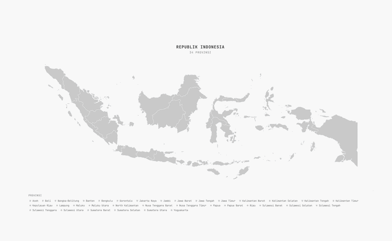

# indonesia-map

Interactive Indonesia map with 34 provinces. Hover to see province names. Pure HTML/CSS/JS, no dependencies.



## usage

Serve it locally (fetch won't work with `file://`):

```bash
python3 -m http.server 8080
```

Open `http://localhost:8080`.

## data

SVG map data from [simplemaps.com/gis/country/id](https://simplemaps.com/gis/country/id) (free for commercial use with attribution).

## stack

- vanilla html/css/js
- JetBrains Mono
- simplemaps SVG
